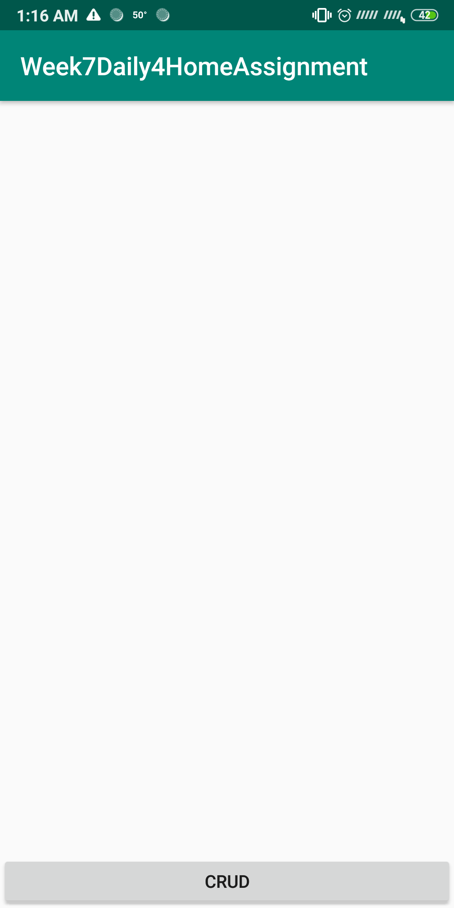
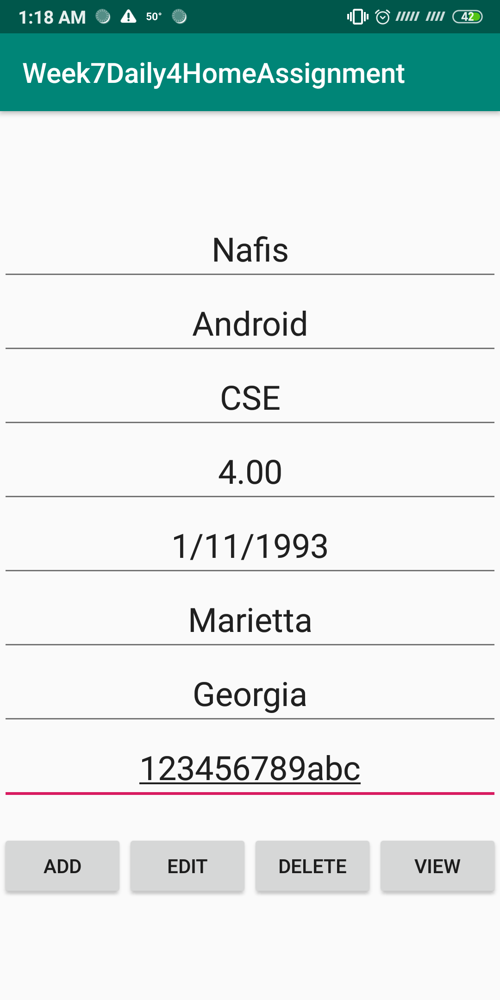
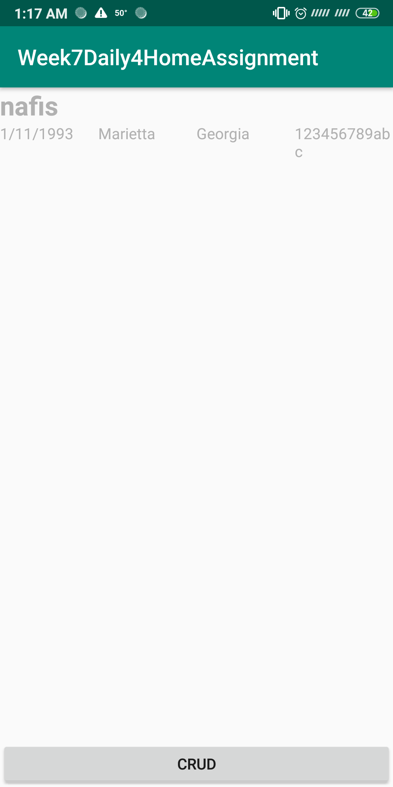
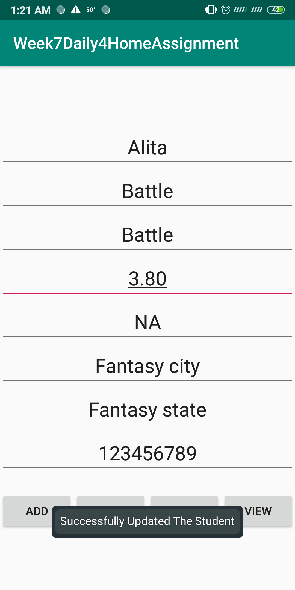

# Week7Daily4HomeAssignment
Refactor of week 2 daily 2 app from java to kotlin

When the app starts first time. No data in database.

Adding new student

Showing in recyclerview

Added antoher student

Retrieved by SSN

Edited student

Deleted student

